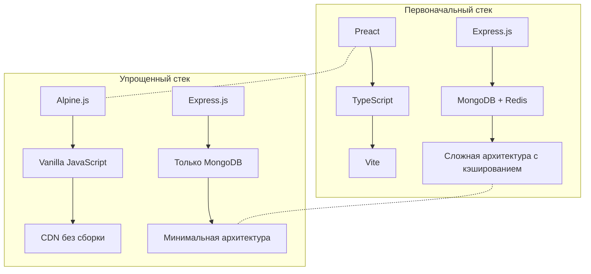
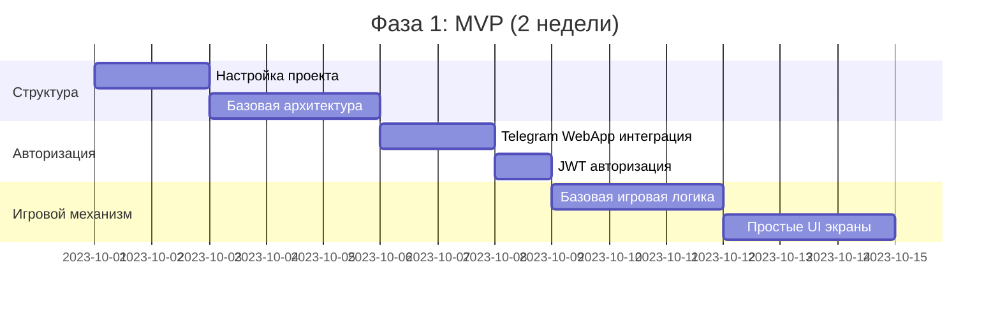
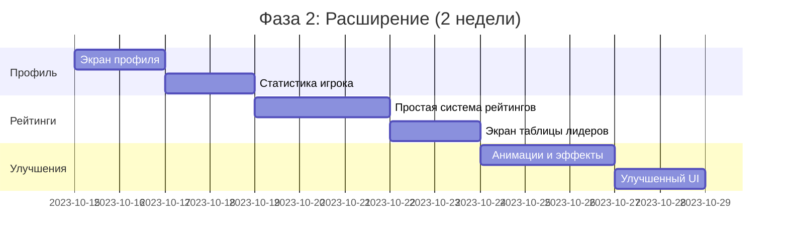
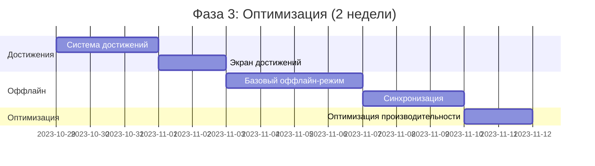
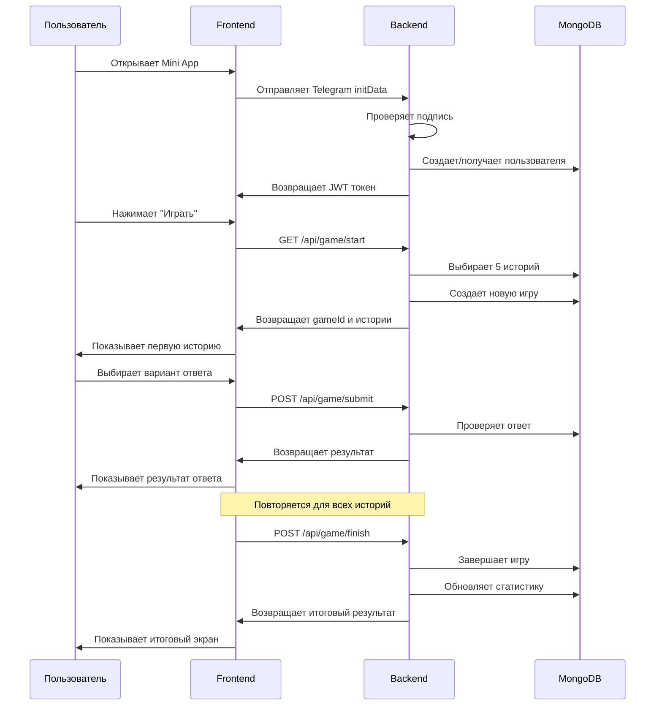
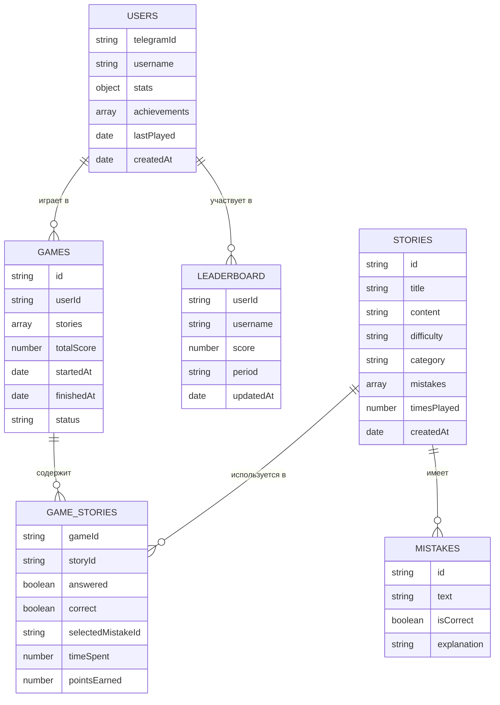

# Техническое Задание: Telegram Mini App "Криминальный Блеф" v2.0
## Упрощенная и оптимизированная версия для быстрой реализации

## 1. Общее описание проекта

### 1.1 Концепция
**"Криминальный Блеф"** — интерактивная игра-викторина в формате Telegram Mini App, где пользователи анализируют криминальные истории и определяют ключевые ошибки преступников. Игра имеет образовательную ценность и развлекательный характер.

### 1.2 Целевая аудитория
- Пользователи Telegram (18+)
- Интересующиеся криминалистикой, детективами, головоломками
- Любители интеллектуальных игр и викторин

### 1.3 Ключевые метрики успеха
- Время первой интерактивности (TTI) < 1 секунда
- Размер бандла < 150KB (gzip)
- Конверсия установки: >40% от показов в Telegram

## 2. Оптимизированный технологический стек

### 2.1 Frontend (Упрощенный)

| Компонент | Технология | Назначение |
|-----------|------------|------------|
| Base | HTML5 + CSS3 + JavaScript | Основа приложения, без транспиляции |
| UI библиотека | Alpine.js (3kb) | Минимальный, реактивный UI без сборки |
| Стили | CSS Variables | Темизация и единые стили без фреймворков |
| Хранение | localStorage | Сохранение игрового прогресса |
| Иконки | SVG | Векторные иконки с минимальным размером |

### 2.2 Backend (Упрощенный)

| Компонент | Технология | Назначение |
|-----------|------------|------------|
| Серверная платформа | Node.js + Express | Простой REST API |
| База данных | MongoDB | Единая БД для всех данных |
| Аутентификация | JWT | Токены на основе Telegram WebApp данных |
| Деплой | Railway | Простой PaaS с автоматическим CI/CD |

### 2.3 Сравнение с первоначальным стеком



## 3. Упрощенная структура данных

### 3.1 Коллекция `stories`

```javascript
// MongoDB Schema
const storySchema = {
  id: String,              // Уникальный ID
  title: String,           // Заголовок истории
  content: String,         // Текст истории (до 300 символов)
  difficulty: String,      // "easy", "medium", "hard"
  category: String,        // "robbery", "theft", "fraud", "murder", "other"
  mistakes: [              // Варианты ответов
    {
      id: String,          
      text: String,        // Текст варианта ошибки
      isCorrect: Boolean,  // Правильный ли вариант
      explanation: String  // Объяснение
    }
  ],
  timesPlayed: Number,     // Статистика игр
  createdAt: Date          // Дата создания
}
```

### 3.2 Коллекция `users`

```javascript
// MongoDB Schema
const userSchema = {
  telegramId: String,       // ID пользователя в Telegram
  username: String,         // Имя пользователя
  firstName: String,        // Имя
  lastName: String,         // Фамилия
  stats: {
    totalGames: Number,     // Общее количество игр
    correctAnswers: Number, // Правильные ответы
    totalScore: Number,     // Общий счет
    maxStreak: Number       // Лучшая серия
  },
  achievements: [String],   // ID достижений
  lastPlayed: Date,         // Дата последней игры
  createdAt: Date           // Дата создания
}
```

### 3.3 Коллекция `games`

```javascript
// MongoDB Schema
const gameSchema = {
  id: String,              // Уникальный ID
  userId: String,          // ID пользователя
  stories: [{              // Истории в игре
    storyId: String,       // ID истории
    answered: Boolean,     // Отвечено ли
    correct: Boolean,      // Правильно ли
    selectedMistakeId: String, // Выбранный вариант
    timeSpent: Number,     // Затраченное время (мс)
    pointsEarned: Number   // Полученные очки
  }],
  totalScore: Number,      // Общий счет
  startedAt: Date,         // Начало игры
  finishedAt: Date,        // Конец игры
  status: String           // "active", "completed" или "abandoned"
}
```

### 3.4 Коллекция `leaderboard` (индексы в MongoDB)

```javascript
// MongoDB Schema с индексами
const leaderboardSchema = {
  userId: String,          // ID пользователя
  username: String,        // Имя пользователя
  score: Number,           // Количество очков
  period: String,          // "daily", "weekly", "all-time"
  updatedAt: Date          // Дата обновления
}

// Создание составного индекса
db.leaderboard.createIndex({ period: 1, score: -1 });
```

## 4. Подробный поэтапный план реализации

### Фаза 1: MVP (Минимально жизнеспособный продукт)



#### Ключевые компоненты MVP:
- Авторизация через Telegram
- Базовая игровая механика (5 вопросов)
- Простой UI без анимаций
- Сохранение результатов

### Фаза 2: Расширение функциональности



#### Дополнения во второй фазе:
- Профиль пользователя
- Базовые рейтинги
- Визуальные улучшения

### Фаза 3: Оптимизация и дополнительная функциональность (опционально)



## 5. Подробные API эндпоинты

### 5.1 Аутентификация

```javascript
// POST /api/auth/init
/* 
Запрос:
{
  "initData": "строка_данных_от_Telegram_WebApp"
}

Ответ:
{
  "token": "jwt_токен",
  "user": {
    "telegramId": "123456789",
    "username": "username",
    "firstName": "Имя",
    "lastName": "Фамилия",
    "isNew": true/false
  }
}

Статус: 200 OK, 401 Unauthorized
*/
```

### 5.2 Игровые эндпоинты (минимальный набор)

```javascript
// GET /api/game/start
/*
Ответ:
{
  "gameId": "game_id",
  "stories": [
    {
      "id": "story_id",
      "title": "Заголовок",
      "content": "Текст истории",
      "difficulty": "medium",
      "mistakes": [
        {
          "id": "mistake_id",
          "text": "Текст ошибки"
        }
      ]
    }
  ]
}

Статус: 200 OK, 401 Unauthorized
*/

// POST /api/game/submit
/*
Запрос:
{
  "gameId": "game_id",
  "storyId": "story_id",
  "mistakeId": "mistake_id",
  "responseTime": 5000  // в миллисекундах
}

Ответ:
{
  "correct": true/false,
  "explanation": "Объяснение ответа",
  "pointsEarned": 100,
  "totalScore": 250
}

Статус: 200 OK, 400 Bad Request
*/

// POST /api/game/finish
/*
Запрос:
{
  "gameId": "game_id"
}

Ответ:
{
  "totalScore": 500,
  "correctAnswers": 4,
  "totalQuestions": 5,
  "accuracy": 80,
  "leaderboardPosition": {
    "allTime": 42
  }
}

Статус: 200 OK, 400 Bad Request
*/
```

### 5.3 Профиль и рейтинги (фаза 2)

```javascript
// GET /api/user/profile
/*
Ответ:
{
  "telegramId": "123456789",
  "username": "username",
  "stats": {
    "totalGames": 10,
    "correctAnswers": 35,
    "totalScore": 3500,
    "accuracy": 70,
    "maxStreak": 8
  },
  "lastPlayed": "2023-10-15T14:30:00Z"
}

Статус: 200 OK, 401 Unauthorized
*/

// GET /api/leaderboard/all-time?page=1&limit=20
/*
Ответ:
{
  "entries": [
    {
      "rank": 1,
      "username": "leader1",
      "score": 9500,
      "isCurrentUser": false
    },
    // ...
  ],
  "pagination": {
    "page": 1,
    "limit": 20,
    "total": 156
  },
  "currentUser": {
    "rank": 42,
    "score": 3500
  }
}

Статус: 200 OK
*/
```

## 6. Интерфейс пользователя (Упрощенный)

### 6.1 Макеты экранов и компоненты

| Экран | Основные компоненты | Действия |
|-------|---------------------|----------|
| **Стартовый** | Логотип, кнопка "Играть" | Начать игру |
| **Игровой** | Текст истории, 3 варианта ответа, таймер, счетчик | Выбрать ответ |
| **Результат вопроса** | Индикатор правильности, объяснение, очки | Перейти к следующему |
| **Результаты игры** | Счет, статистика, кнопка "Играть снова" | Новая игра |
| **Профиль** (Фаза 2) | Статистика, история игр | Просмотр статистики |
| **Рейтинг** (Фаза 2) | Таблица лидеров, позиция игрока | Просмотр рейтинга |

### 6.2 Диаграмма взаимодействия экранов

```mermaid
flowchart TD
    A[Стартовый экран] -->|Нажатие "Играть"| B[Игровой экран]
    B -->|Выбор ответа| C[Экран результата вопроса]
    C -->|Далее| D{Последний вопрос?}
    D -->|Нет| B
    D -->|Да| E[Экран результатов игры]
    E -->|Играть снова| B
    E -->|Главное меню| A
    A -->|Мой профиль| F[Экран профиля]
    A -->|Рейтинг| G[Экран рейтинга]
    F -->|Назад| A
    G -->|Назад| A
```

### 6.3 Упрощенные стили интерфейса

```css
/* Базовые переменные для темизации */
:root {
  --primary-color: #3498db;
  --secondary-color: #2ecc71;
  --error-color: #e74c3c;
  --background-color: #121212;
  --text-color: #f5f5f5;
  --card-bg-color: #1e1e1e;
  --border-radius: 8px;
  --spacing-unit: 8px;
}

/* Telegram тёмная тема */
[data-theme="dark"] {
  --background-color: #212121;
  --card-bg-color: #2c2c2c;
  --text-color: #ffffff;
}

/* Telegram светлая тема */
[data-theme="light"] {
  --background-color: #f5f5f5;
  --card-bg-color: #ffffff;
  --text-color: #212121;
}

/* Пример стилей для карточки истории */
.story-card {
  background-color: var(--card-bg-color);
  border-radius: var(--border-radius);
  padding: calc(var(--spacing-unit) * 2);
  margin-bottom: calc(var(--spacing-unit) * 2);
  box-shadow: 0 2px 4px rgba(0, 0, 0, 0.2);
}

/* Пример стилей для кнопки ответа */
.answer-button {
  background-color: var(--card-bg-color);
  color: var(--text-color);
  border: 1px solid rgba(255, 255, 255, 0.1);
  border-radius: var(--border-radius);
  padding: calc(var(--spacing-unit) * 1.5);
  margin-bottom: var(--spacing-unit);
  width: 100%;
  text-align: left;
  transition: background-color 0.2s;
}

.answer-button:active {
  background-color: var(--primary-color);
}

/* Стили для правильного/неверного ответа */
.correct {
  background-color: var(--secondary-color);
}

.incorrect {
  background-color: var(--error-color);
}
```

## 7. Интеграция с Telegram WebApp

### 7.1 Базовое подключение WebApp

```javascript
// Инициализация Telegram Mini App (упрощенный подход)
document.addEventListener('DOMContentLoaded', () => {
  // Получение объекта WebApp
  const tg = window.Telegram.WebApp;
  
  // Раскрыть приложение на весь экран
  tg.expand();
  
  // Включить кнопку "Назад"
  tg.BackButton.onClick(() => {
    // Обработка возврата на предыдущий экран
    if (currentScreen !== 'main') {
      navigateToScreen('main');
      tg.BackButton.hide();
    }
  });
  
  // Получение данных пользователя
  if (tg.initDataUnsafe && tg.initDataUnsafe.user) {
    const user = tg.initDataUnsafe.user;
    console.log('User:', user);
    
    // Отправить данные для авторизации на сервер
    fetch('/api/auth/init', {
      method: 'POST',
      headers: {
        'Content-Type': 'application/json'
      },
      body: JSON.stringify({ initData: tg.initData })
    })
    .then(response => response.json())
    .then(data => {
      // Сохранить токен
      localStorage.setItem('token', data.token);
      // Инициализировать приложение
      initApp();
    });
  }
  
  // Сообщить Telegram, что приложение готово
  tg.ready();
});
```

### 7.2 Интеграция тактильной обратной связи

```javascript
// Упрощенная функция для haptic feedback
function provideFeedback(type) {
  try {
    const tg = window.Telegram.WebApp;
    
    switch (type) {
      case 'correct':
        // Позитивная обратная связь
        tg.HapticFeedback.notificationOccurred('success');
        break;
      case 'incorrect':
        // Негативная обратная связь
        tg.HapticFeedback.notificationOccurred('error');
        break;
      case 'tap':
        // Легкая обратная связь при нажатии
        tg.HapticFeedback.impactOccurred('light');
        break;
    }
  } catch (error) {
    // Fallback для тестирования вне Telegram
    console.log('Haptic feedback not available');
  }
}
```

### 7.3 Проверка подлинности данных WebApp

```javascript
// server.js - Express middleware для проверки данных Telegram
const crypto = require('crypto');

function verifyTelegramWebAppData(req, res, next) {
  try {
    const { initData } = req.body;
    if (!initData) {
      return res.status(401).json({ error: 'No initData provided' });
    }

    // Парсинг данных
    const data = new URLSearchParams(initData);
    const hash = data.get('hash');
    data.delete('hash');
    
    // Сортировка параметров
    const dataCheckArr = [];
    for (const [key, value] of [...data.entries()].sort()) {
      dataCheckArr.push(`${key}=${value}`);
    }
    const dataCheckString = dataCheckArr.join('\n');
    
    // Создание секретного ключа на основе токена бота
    const secret = crypto
      .createHmac('sha256', 'WebAppData')
      .update(process.env.TELEGRAM_BOT_TOKEN)
      .digest();
    
    // Проверка хэша
    const generatedHash = crypto
      .createHmac('sha256', secret)
      .update(dataCheckString)
      .digest('hex');
    
    if (generatedHash !== hash) {
      return res.status(401).json({ error: 'Invalid hash' });
    }
    
    // Получение данных пользователя
    if (data.has('user')) {
      req.telegramUser = JSON.parse(data.get('user'));
    }
    
    next();
  } catch (error) {
    console.error('Error verifying Telegram data:', error);
    res.status(401).json({ error: 'Authentication failed' });
  }
}
```

## 8. Алгоритмы и бизнес-логика

### 8.1 Система начисления очков (упрощенная)

```javascript
/**
 * Расчет очков за ответ (упрощенный алгоритм)
 * @param {boolean} correct - Правильный ли ответ
 * @param {number} responseTime - Время ответа в миллисекундах
 * @param {string} difficulty - Сложность вопроса
 * @returns {object} - Объект с деталями начисления очков
 */
function calculatePoints(correct, responseTime, difficulty) {
  // Если ответ неверный, очки не начисляются
  if (!correct) {
    return { points: 0, total: 0 };
  }
  
  // Базовые очки за правильный ответ
  const BASE_POINTS = 100;
  
  // Бонус за скорость (максимум 50 очков)
  const MAX_TIME = 15000; // 15 секунд
  const timeBonus = Math.round(Math.max(0, 50 * (1 - responseTime / MAX_TIME)));
  
  // Бонус за сложность
  let difficultyBonus = 0;
  if (difficulty === 'medium') difficultyBonus = 25;
  if (difficulty === 'hard') difficultyBonus = 50;
  
  // Общий счет
  const total = BASE_POINTS + timeBonus + difficultyBonus;
  
  return {
    base: BASE_POINTS,
    timeBonus,
    difficultyBonus,
    total
  };
}
```

### 8.2 Алгоритм подбора историй

```javascript
/**
 * Подбор историй для игры
 * @param {string} userId - ID пользователя
 * @param {string} difficulty - Сложность (опционально)
 * @returns {Promise<Array>} - Массив историй
 */
async function selectStories(userId, difficulty = null) {
  try {
    // Получаем ранее сыгранные истории пользователя
    const games = await db.collection('games')
      .find({ userId })
      .project({ 'stories.storyId': 1 })
      .toArray();
    
    // Извлекаем ID сыгранных историй
    const playedStoryIds = games
      .flatMap(game => game.stories.map(s => s.storyId));
    
    // Формируем запрос
    const query = {};
    
    // Добавляем фильтр по сложности, если указан
    if (difficulty) {
      query.difficulty = difficulty;
    }
    
    // Сначала пытаемся найти новые истории
    let stories = await db.collection('stories')
      .find({ 
        ...query, 
        _id: { $nin: playedStoryIds }
      })
      .limit(5)
      .toArray();
    
    // Если новых историй недостаточно, добавляем уже сыгранные
    if (stories.length < 5) {
      const remainingCount = 5 - stories.length;
      
      const additionalStories = await db.collection('stories')
        .find({ ...query })
        .sort({ timesPlayed: 1 }) // Наименее популярные
        .limit(remainingCount)
        .toArray();
      
      stories = [...stories, ...additionalStories];
    }
    
    // Перемешиваем истории
    return shuffleArray(stories);
  } catch (error) {
    console.error('Error selecting stories:', error);
    throw error;
  }
}

// Функция перемешивания массива
function shuffleArray(array) {
  const newArray = [...array];
  for (let i = newArray.length - 1; i > 0; i--) {
    const j = Math.floor(Math.random() * (i + 1));
    [newArray[i], newArray[j]] = [newArray[j], newArray[i]];
  }
  return newArray;
}
```

## 9. Сценарии взаимодействия с пользователем

### 9.1 Базовый игровой цикл



### 9.2 Основные пользовательские потоки

1. **Первый запуск**:
   - Пользователь открывает Telegram бот
   - Нажимает кнопку Menu в боте
   - Запускается Mini App
   - Происходит авторизация через Telegram
   - Показывается онбординг
   - Пользователь начинает игру

2. **Ежедневная игра**:
   - Пользователь возвращается в бот
   - Запускает Mini App
   - Автоматическая авторизация
   - Переход к основному экрану
   - Начало новой игры

3. **Просмотр профиля** (Фаза 2):
   - Пользователь запускает Mini App
   - Выбирает "Мой профиль"
   - Просматривает статистику
   - Возвращается в главное меню

## 10. Диаграмма базы данных и взаимосвязей



## 11. Оптимизация производительности

### 11.1 Оптимизация размера бандла

| Техника | Описание | Эффект |
|---------|----------|--------|
| **Инлайн SVG** | Встраивание SVG напрямую в HTML | Экономия HTTP-запросов |
| **Минификация JS/CSS** | Удаление пробелов и комментариев | Уменьшение размера на 30-40% |
| **Alpine.js вместо React/Preact** | Более легковесная библиотека | Экономия 20-40KB |
| **Инлайн критических стилей** | Стили, необходимые для первого рендеринга | Ускорение первой отрисовки |
| **Lazy loading изображений** | Загрузка изображений по мере прокрутки | Экономия трафика и памяти |

### 11.2 Оптимизация Telegram WebApp

```javascript
// Alpine.js компонент для экрана игры с оптимизациями
document.addEventListener('alpine:init', () => {
  Alpine.data('gameScreen', () => ({
    story: null,
    secondsLeft: 15,
    timer: null,
    
    // Инициализация экрана
    init() {
      // Отключаем анимацию во время загрузки
      document.body.classList.add('loading');
      
      // Инициализация данных игры
      this.loadStory();
      
      // Оптимизации после загрузки контента
      this.$nextTick(() => {
        // Запуск таймера только после отрисовки
        this.startTimer();
        // Включаем анимации
        document.body.classList.remove('loading');
      });
    },
    
    // Загрузка истории
    async loadStory() {
      // Получение истории из локального состояния
      this.story = gameState.getCurrentStory();
      
      // Предзагрузка следующей истории в фоне
      this.preloadNextStory();
    },
    
    // Фоновая предзагрузка следующей истории
    preloadNextStory() {
      const nextStory = gameState.getNextStory();
      if (nextStory) {
        // Предзагружаем только текстовый контент
        // Это очень легкая операция, без блокировки UI
      }
    },
    
    // Обработка выбора ответа
    selectAnswer(mistakeId) {
      clearInterval(this.timer);
      
      // Haptic feedback через Telegram WebApp
      const tg = window.Telegram.WebApp;
      tg.HapticFeedback.impactOccurred('light');
      
      // Отправка ответа с использованием localStorage как кэш
      this.submitAnswer(mistakeId);
    },
    
    // Таймер с оптимизацией перерисовки
    startTimer() {
      this.secondsLeft = 15;
      this.timer = setInterval(() => {
        this.secondsLeft--;
        
        // Оптимизация: перерисовываем только необходимый компонент
        if (this.secondsLeft <= 0) {
          clearInterval(this.timer);
          this.timeExpired();
        }
      }, 1000);
    }
  }));
});
```

## 12. Базовая система аналитики

### 12.1 События для отслеживания

| Событие | Описание | Данные |
|---------|----------|--------|
| `app_open` | Открытие приложения | `userId`, `timestamp`, `referrer` |
| `game_start` | Начало игры | `userId`, `gameId`, `difficulty` |
| `question_answer` | Ответ на вопрос | `userId`, `gameId`, `storyId`, `correct`, `timeSpent` |
| `game_complete` | Завершение игры | `userId`, `gameId`, `score`, `correctAnswers` |
| `profile_view` | Просмотр профиля | `userId` |
| `leaderboard_view` | Просмотр рейтинга | `userId`, `period` |
| `error` | Ошибка в приложении | `userId`, `error`, `context` |

### 12.2 Базовая реализация аналитики

```javascript
// Простая реализация аналитики
const analytics = {
  // Инициализация
  init(userId) {
    this.userId = userId;
    this.events = [];
    this.flushInterval = setInterval(() => this.flush(), 30000);
  },
  
  // Запись события
  track(eventName, data = {}) {
    const event = {
      userId: this.userId,
      event: eventName,
      timestamp: new Date().toISOString(),
      ...data
    };
    
    // Добавляем в очередь
    this.events.push(event);
    
    // Если в очереди накопилось много событий, отправляем на сервер
    if (this.events.length >= 10) {
      this.flush();
    }
  },
  
  // Отправка событий на сервер
  async flush() {
    if (this.events.length === 0) return;
    
    const eventsToSend = [...this.events];
    this.events = [];
    
    try {
      await fetch('/api/analytics/batch', {
        method: 'POST',
        headers: {
          'Content-Type': 'application/json',
          'Authorization': `Bearer ${localStorage.getItem('token')}`
        },
        body: JSON.stringify({ events: eventsToSend })
      });
    } catch (error) {
      // В случае ошибки, возвращаем события в очередь
      this.events = [...eventsToSend, ...this.events];
      console.error('Failed to send analytics:', error);
    }
  }
};
```

## 13. Railway развертывание

### 13.1 Файл конфигурации Railway

```json
// railway.json
{
  "$schema": "https://railway.app/railway.schema.json",
  "build": {
    "builder": "NIXPACKS",
    "buildCommand": "npm install"
  },
  "deploy": {
    "restartPolicyType": "ON_FAILURE",
    "restartPolicyMaxRetries": 10,
    "startCommand": "npm start",
    "healthcheckPath": "/api/health",
    "healthcheckTimeout": 5,
    "healthcheckInterval": 30
  }
}
```

### 13.2 Структура проекта для Railway

```
/
├── public/                  # Статические файлы (frontend)
│   ├── index.html           # Входная точка приложения
│   ├── app.js               # Alpine.js код приложения
│   ├── styles.css           # Стили
│   └── assets/              # Изображения, иконки и т.д.
├── src/                     # Исходный код сервера
│   ├── index.js             # Входная точка Express
│   ├── routes/              # Маршруты API
│   │   ├── auth.js          # Аутентификация
│   │   ├── game.js          # Игровая логика
│   │   ├── user.js          # Пользовательский профиль
│   │   └── leaderboard.js   # Рейтинги
│   ├── models/              # Модели данных
│   ├── middleware/          # Middleware
│   └── utils/               # Утилиты
├── package.json             # Зависимости и скрипты
├── .env                     # Переменные окружения
└── railway.json             # Конфигурация Railway
```

### 13.3 Переменные окружения для Railway

```
# Базовые настройки
NODE_ENV=production
PORT=3000

# MongoDB
MONGODB_URI=mongodb+srv://...

# JWT
JWT_SECRET=your-secret-key

# Telegram
TELEGRAM_BOT_TOKEN=your-bot-token

# CORS
CORS_ORIGIN=https://t.me
```

## 14. Рекомендации по оптимизации для Cursor AI

### 14.1 Структура JavaScript для Cursor AI

```javascript
/**
 * Функция обработки API запроса
 * @param {Request} req - Express запрос
 * @param {Response} res - Express ответ
 */
async function handleGameStart(req, res) {
  try {
    // 1. Получить пользователя из токена
    const { id: userId } = req.user;
    
    // 2. Получить параметры запроса
    const { difficulty, category } = req.query;
    
    // 3. Выбрать истории
    const stories = await selectStories(userId, difficulty, category);
    
    // 4. Создать новую игру
    const gameId = generateId();
    await db.collection('games').insertOne({
      id: gameId,
      userId,
      stories: stories.map(story => ({
        storyId: story.id,
        answered: false,
        correct: false,
        timeSpent: 0,
        pointsEarned: 0
      })),
      totalScore: 0,
      startedAt: new Date(),
      status: 'active'
    });
    
    // 5. Отформатировать ответ для клиента
    const responseData = {
      gameId,
      stories: stories.map(story => ({
        id: story.id,
        title: story.title,
        content: story.content,
        difficulty: story.difficulty,
        mistakes: story.mistakes.map(mistake => ({
          id: mistake.id,
          text: mistake.text
        }))
      }))
    };
    
    // 6. Отправить ответ
    res.json(responseData);
  } catch (error) {
    console.error('Error starting game:', error);
    res.status(500).json({ error: 'Failed to start game' });
  }
}
```

### 14.2 Функциональные компоненты для Alpine.js

```html
<!-- Пример Alpine.js компонента для игрового экрана -->
<div x-data="gameScreen" class="game-container">
  <div class="game-header">
    <div class="score" x-text="'Счет: ' + score"></div>
    <div class="progress" x-text="'Вопрос: ' + (currentQuestionIndex + 1) + '/' + totalQuestions"></div>
    <div class="timer">
      <span x-text="secondsLeft"></span>s
      <div class="timer-bar" :style="'width: ' + (secondsLeft / 15 * 100) + '%'"></div>
    </div>
  </div>
  
  <div class="story-card" x-show="story">
    <h3 x-text="story.title" class="story-title"></h3>
    <p x-text="story.content" class="story-content"></p>
  </div>
  
  <template x-if="story">
    <div class="answers-container">
      <template x-for="mistake in story.mistakes" :key="mistake.id">
        <button 
          class="answer-button" 
          x-text="mistake.text" 
          @click="selectAnswer(mistake.id)"
          :disabled="answered">
        </button>
      </template>
    </div>
  </template>
  
  <div x-show="result" class="result-container">
    <div :class="{'result-correct': result.correct, 'result-incorrect': !result.correct}">
      <h3 x-text="result.correct ? 'Правильно!' : 'Неправильно!'"></h3>
      <p x-text="result.explanation"></p>
      <div class="points">
        <span x-text="'+' + result.pointsEarned + ' очков'"></span>
      </div>
      <button @click="nextQuestion" class="next-button">Далее</button>
    </div>
  </div>
</div>
```

### 14.3 Структура Express-маршрутов

```javascript
// routes/game.js
const express = require('express');
const router = express.Router();
const { authMiddleware } = require('../middleware/auth');
const { 
  handleGameStart, 
  handleGameSubmit, 
  handleGameFinish 
} = require('../controllers/gameController');

/**
 * @route   GET /api/game/start
 * @desc    Начать новую игру
 * @access  Private
 */
router.get('/start', authMiddleware, handleGameStart);

/**
 * @route   POST /api/game/submit
 * @desc    Отправить ответ на вопрос
 * @access  Private
 */
router.post('/submit', authMiddleware, handleGameSubmit);

/**
 * @route   POST /api/game/finish
 * @desc    Завершить игру
 * @access  Private
 */
router.post('/finish', authMiddleware, handleGameFinish);

module.exports = router;
```

## 15. Заключение и дальнейшие шаги

1. **MVP** (2 недели):
   - Базовая авторизация через Telegram
   - Простой игровой процесс
   - Сохранение результатов

2. **Фаза 2** (2 недели):
   - Профиль пользователя
   - Рейтинговая система
   - Улучшения UI/UX

3. **Фаза 3** (опционально, 2 недели):
   - Система достижений
   - Базовый оффлайн-режим
   - Оптимизации производительности

4. **После запуска**:
   - Мониторинг пользовательских метрик
   - Расширение контента (новые истории)
   - Итеративные улучшения на основе обратной связи

---

**Примечание для Cursor AI**: Это техническое задание организовано таким образом, чтобы максимально упростить процесс разработки. Весь код разделен на функциональные блоки, которые можно реализовывать поэтапно, начиная с самых базовых компонентов MVP.
