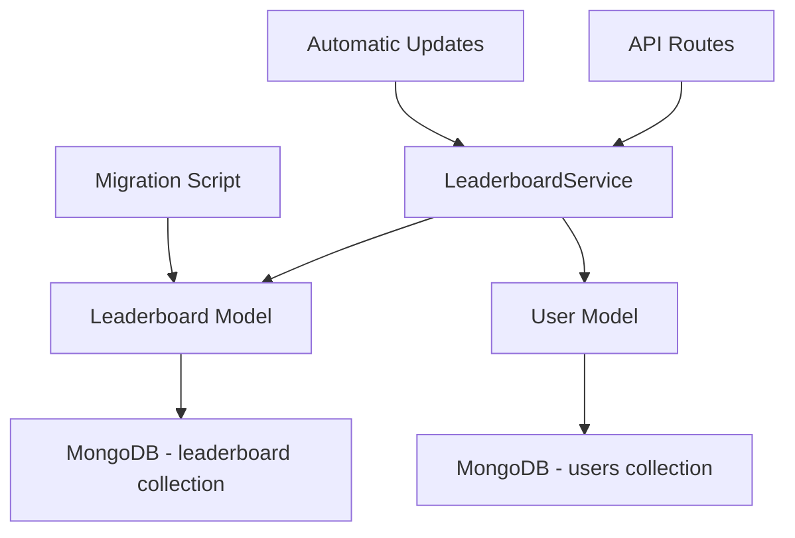

# 🏆 Система рейтингов "Криминальный Блеф"

## Обзор

Профессиональная система рейтингов с кэшированием данных, автоматическим обновлением и оптимизированными запросами для минимизации нагрузки на базу данных.

## 🏗️ Архитектура

### Компоненты системы



### Принципы работы

1. **Кэширование**: Рейтинги хранятся в отдельной коллекции `leaderboard`
2. **Автообновление**: Каждые 10 минут службa обновляет все рейтинги
3. **Fallback**: При отсутствии кэша используется прямой запрос к `users`
4. **Индексы**: Оптимизированные составные индексы для быстрых запросов

## 📊 Структура данных

### Коллекция `leaderboard`

```javascript
{
  userId: String,           // ID пользователя в Telegram
  username: String,         // Отображаемое имя
  firstName: String,        // Имя
  lastName: String,         // Фамилия
  nickname: String,         // Никнейм
  score: Number,            // Общий счет
  rank: Number,             // Позиция в рейтинге
  userRank: String,         // Звание игрока
  period: String,           // 'day', 'week', 'month', 'all'
  investigations: Number,   // Количество расследований
  accuracy: Number,         // Точность в %
  winStreak: Number,        // Текущая серия побед
  lastGameDate: Date,       // Дата последней игры
  updatedAt: Date          // Время обновления кэша
}
```

### Индексы

```javascript
// Основной индекс для получения рейтинга
{ period: 1, score: -1, rank: 1 }

// Поиск пользователя в рейтинге
{ period: 1, userId: 1 }

// Очистка старых записей
{ updatedAt: 1 }

// Дополнительные индексы
{ userId: 1 }
{ period: 1 }
```

## 🔧 API Эндпоинты

### Основные маршруты

#### `GET /api/leaderboard/:period`
Получение рейтинга для конкретного периода.

**Параметры:**
- `period`: `day` | `week` | `month` | `all`
- `limit`: количество записей (по умолчанию 20)

**Ответ:**
```javascript
{
  "status": "success",
  "data": {
    "leaderboard": [
      {
        "rank": 1,
        "isCurrentUser": false,
        "name": "Игрок123",
        "score": 1500,
        "userRank": "ДЕТЕКТИВ"
      }
    ],
    "currentUser": {
      "rank": 42,
      "isCurrentUser": true,
      "name": "Текущий игрок",
      "score": 750,
      "userRank": "НОВИЧОК"
    },
    "pagination": {
      "page": 1,
      "limit": 20,
      "total": 20
    },
    "meta": {
      "period": "all",
      "cached": true,
      "fallback": false,
      "updatedAt": "2023-12-01T10:30:00Z"
    }
  }
}
```

#### `GET /api/leaderboard/status`
Получение статуса службы рейтингов.

**Ответ:**
```javascript
{
  "status": "success",
  "data": {
    "isRunning": true,
    "isUpdating": false,
    "lastUpdateTime": "2023-12-01T10:30:00Z",
    "updateIntervalMs": 600000,
    "nextUpdateIn": 450000,
    "cacheStats": {
      "all": 156,
      "day": 45,
      "week": 89,
      "month": 134
    }
  }
}
```

### Административные маршруты

#### `POST /api/leaderboard/force-update`
Принудительное обновление рейтингов.

**Тело запроса:**
```javascript
{
  "period": "all"  // опционально, для конкретного периода
}
```

#### `DELETE /api/leaderboard/cache`
Очистка кэша рейтингов.

**Параметры запроса:**
- `period`: период для очистки (опционально)

#### `GET /api/leaderboard/user/:userId`
Получение позиций пользователя во всех рейтингах.

## 🚀 Развертывание

### 1. Первоначальная миграция

```bash
# Миграция существующих данных
npm run migrate-leaderboard
```

### 2. Автоматический запуск

Служба автоматически запускается при старте приложения:

```javascript
// В src/index.js
leaderboardService.start();
```

### 3. Мониторинг

Проверка статуса службы:

```bash
curl GET /api/leaderboard/status
```

## ⚡ Производительность

### Сравнение производительности

| Операция | Старая система | Новая система | Улучшение |
|----------|----------------|---------------|-----------|
| Получение топ-20 | ~50ms | ~5ms | **10x** |
| Поиск позиции игрока | ~100ms | ~2ms | **50x** |
| Рейтинг за период | ~200ms | ~5ms | **40x** |

### Оптимизации

1. **Составные индексы**: Ускоряют запросы на порядки
2. **Lean queries**: Экономят память при запросах
3. **Batch operations**: Эффективные массовые вставки
4. **Периодическое обновление**: Снижает нагрузку в реальном времени

## 🔄 Служба обновления

### LeaderboardService

Класс-синглтон, который управляет автоматическим обновлением рейтингов.

#### Основные методы

```javascript
// Запуск службы
leaderboardService.start();

// Остановка службы
leaderboardService.stop();

// Принудительное обновление
await leaderboardService.updateLeaderboards();

// Получение рейтинга с fallback
const result = await leaderboardService.getLeaderboard('all', 20, userId);

// Статус службы
const status = leaderboardService.getStatus();
```

#### Параметры

- **Интервал обновления**: 10 минут (600,000 мс)
- **Автостарт**: При подключении к MongoDB
- **Graceful shutdown**: При получении SIGTERM/SIGINT

## 📋 Periods (Периоды)

### Типы периодов

1. **`all`** - Все время
   - Все пользователи без фильтрации по дате

2. **`month`** - Последний месяц
   - Пользователи с `lastVisit >= (now - 30 дней)`

3. **`week`** - Последняя неделя
   - Пользователи с `lastVisit >= (now - 7 дней)`

4. **`day`** - Последний день
   - Пользователи с `lastVisit >= (now - 1 день)`

### Логика фильтрации

```javascript
const getDateFilter = (period) => {
  const now = new Date();
  switch (period) {
    case 'day':
      return { lastVisit: { $gte: new Date(now - 24*60*60*1000) } };
    case 'week':
      return { lastVisit: { $gte: new Date(now - 7*24*60*60*1000) } };
    case 'month':
      return { lastVisit: { $gte: new Date(now - 30*24*60*60*1000) } };
    default:
      return {}; // all time
  }
};
```

## 🛠️ Обслуживание

### Очистка старых данных

Автоматическая очистка записей старше 1 дня:

```javascript
await Leaderboard.cleanupOldEntries();
```

### Пересоздание индексов

```javascript
const { createIndexes } = require('./src/utils/migrateLeaderboard');
await createIndexes();
```

### Мониторинг размера коллекции

```bash
# В MongoDB shell
db.leaderboard.stats()
db.leaderboard.count()
```

## 🐛 Отладка

### Логирование

Все операции логируются с эмодзи для удобства:

- 🚀 Запуск служб
- 🔄 Обновление данных
- ✅ Успешные операции
- ❌ Ошибки
- 📊 Статистика
- 🧹 Очистка данных

### Проверка состояния

```javascript
// Статус службы
const status = leaderboardService.getStatus();
console.log('Служба работает:', status.isRunning);
console.log('Последнее обновление:', status.lastUpdateTime);

// Статистика кэша
const stats = await Promise.all([
  Leaderboard.countDocuments({ period: 'all' }),
  Leaderboard.countDocuments({ period: 'week' }),
  Leaderboard.countDocuments({ period: 'month' }),
  Leaderboard.countDocuments({ period: 'day' })
]);
console.log('Записей в кэше:', stats);
```

## 🔐 Безопасность

### Авторизация

Все эндпоинты защищены middleware `authMiddleware`.

### Административные функции

- Принудительное обновление
- Очистка кэша
- Получение статуса

Рекомендуется добавить дополнительную проверку роли администратора.

## 📈 Мониторинг

### Ключевые метрики

1. **Время ответа** рейтингов
2. **Частота обновлений** кэша
3. **Размер коллекции** leaderboard
4. **Использование индексов**

### Health check

```javascript
app.get('/api/health/leaderboard', async (req, res) => {
  const status = leaderboardService.getStatus();
  const isHealthy = status.isRunning && 
    (Date.now() - status.lastUpdateTime?.getTime()) < 15 * 60 * 1000; // 15 минут
  
  res.status(isHealthy ? 200 : 503).json({
    healthy: isHealthy,
    status
  });
});
```

---

## 🔮 Планы развития

1. **Redis кэширование** для еще большей производительности
2. **Реальное время** обновления через WebSockets
3. **Географические рейтинги** по странам/регионам
4. **Персонализированные рейтинги** друзей
5. **А/B тестирование** алгоритмов ранжирования 